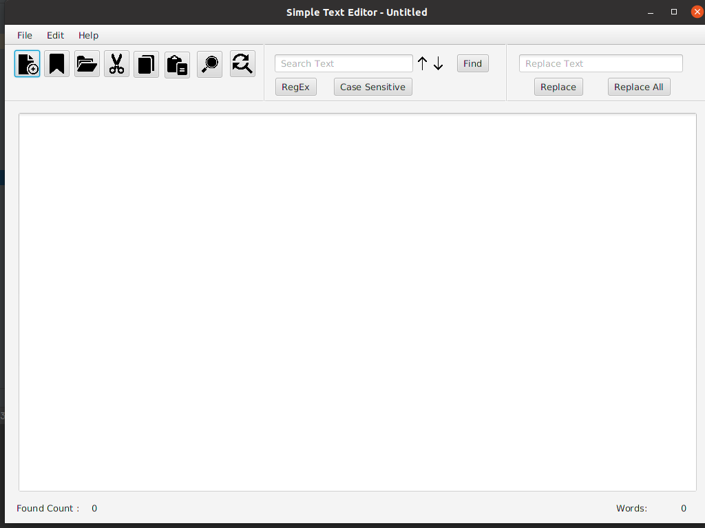

#Simple Text Editor

###The Repository
This repository is where I develop the Simple Text Editor. I have developed thi text editor to improve the knowledge about java FX, java and other technologies.
This source code is available 
The source code is available to everyone under the standard [MIT License](https://choosealicense.com/licenses/mit/).

###Simple Text Editor

###License
Copyright © 2022 -  B G Thakshila Nuwangi. All rights reserved.

Licensed under the [MIT License](https://choosealicense.com/licenses/mit/)